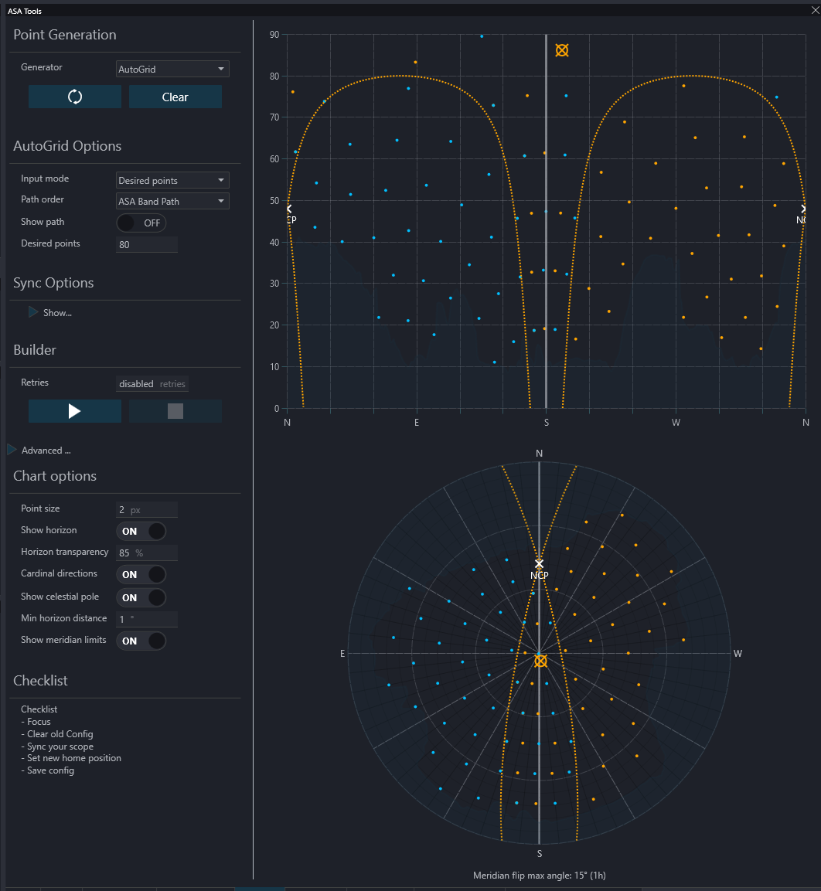
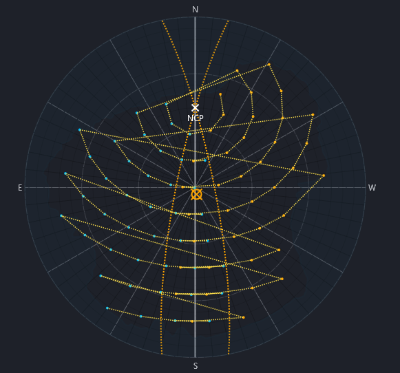
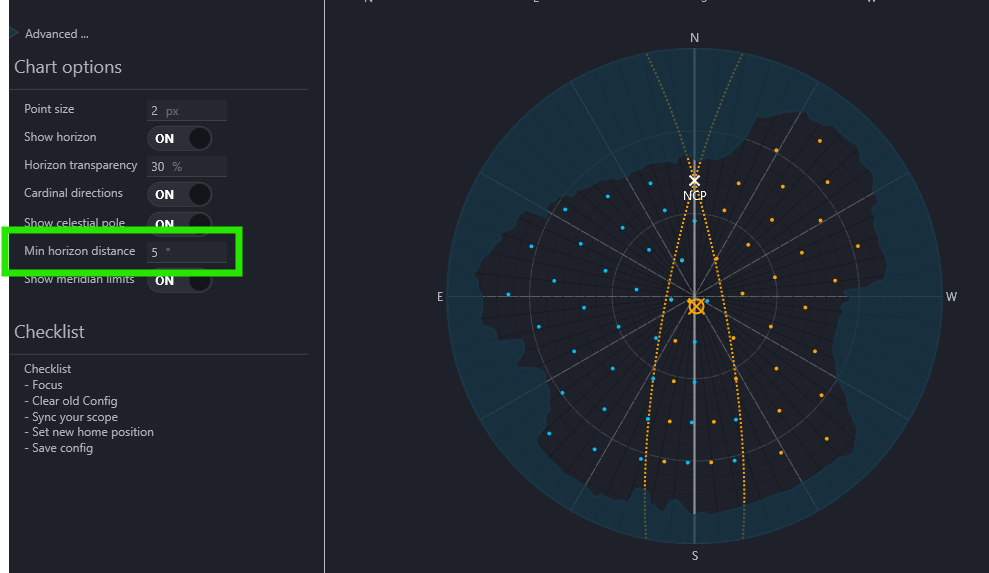
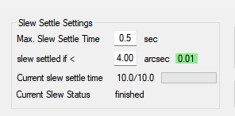
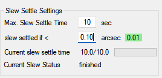
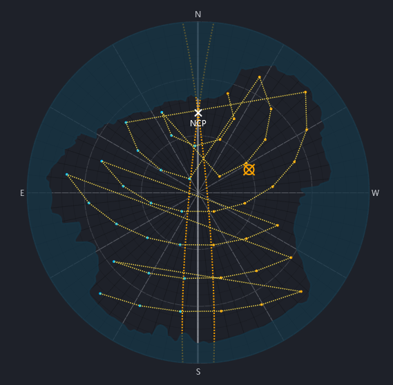
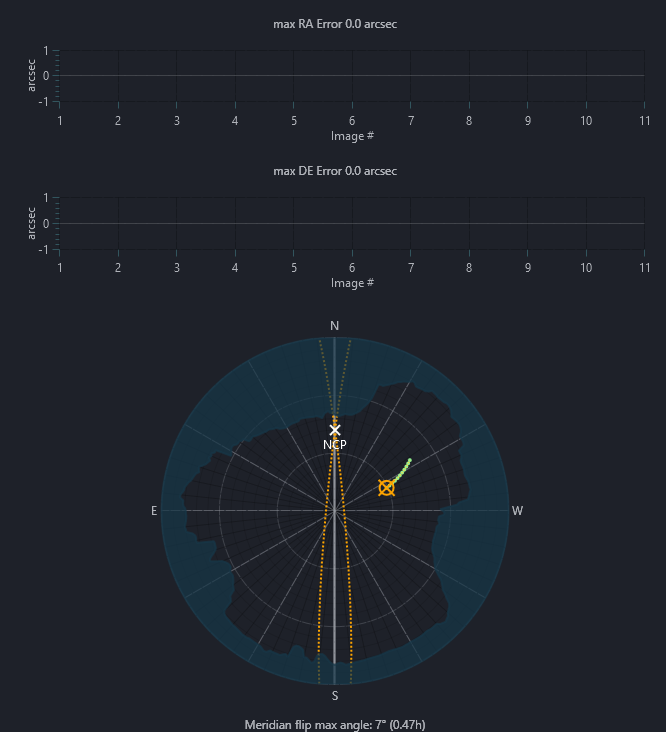

# ASA Tools for N.I.N.A. Plugin

A plugin for [N.I.N.A.](https://nighttime-imaging.eu/) (Nighttime Imaging 'N' Astronomy) designed to enhance automation workflows for ASA mounts. This plugin provides sequence items and triggers for controlling MLPT workflows, building full-sky models, equipment management, and error handling.

## Table of Contents

- [Concepts & Glossary](#concepts--glossary)
- [System Requirements](#system-requirements)
- [Installation](#installation)
- [Getting Started](#getting-started)
- [Which Feature Do I Need?](#which-feature-do-i-need)
- [Mount Model Builder](#mount-model-builder)
  - [Grid Import / Export](#grid-import--export)
- [MLPT Integration](#mlpt-integration)
- [Advanced Sequence Example](#advanced-sequence-example)
- [Typical Imaging Night Workflow](#typical-imaging-night-workflow)
- [Enhanced Plugin Tools](#enhanced-plugin-tools)
- [Important Operational Notes](#important-operational-notes)
- [Troubleshooting](#troubleshooting)
- [Plugin Options Reference](#plugin-options-reference)

---

# Concepts & Glossary

Before diving into the features, it helps to understand a few key concepts and terms used throughout this plugin and in the ASA ecosystem.

## Pointing Model (Full-Sky Model)
A pointing model is a calibration map of the entire sky. The mount slews to dozens or hundreds of stars distributed across the sky, plate-solves each one, and records the offset between where it *thought* it was pointing and where it *actually* was. These offsets are collected into a **POX file** and loaded into AutoSlew, which then calculates a mathematical correction surface. Once loaded, the mount applies this correction for every slew, dramatically improving pointing accuracy across the whole sky.

A full-sky model is typically built once and remains valid for many months, as long as the mount is not physically disturbed.

## MLPT — Multiple Local Pointing Tracking
MLPT is a *localized* pointing correction built for a specific target on a specific night. Where the full-sky model corrects large-scale pointing errors across the whole sky, MLPT follows the target's sidereal path over a defined time window (typically 30–120 minutes) and builds a fine local correction optimized for that arc of the sky. This improves both pointing and tracking accuracy during a long imaging session.

MLPT is meant to be run **every session**, either manually from the plugin tab or automatically via the MLPT sequence triggers. A completed MLPT is indicated by a yellow LPT button in AutoSlew.

## AutoSlew
AutoSlew is the ASA mount control software. This plugin communicates with AutoSlew via the ASCOM driver to issue commands (model building, MLPT, fan/cover/motor control, etc.). AutoSlew must be running and connected to the mount before using this plugin.

## POX File
A POX file is the intermediate output of a model build. The plugin writes measured pointing offsets to this file (in `%programdata%\ASA\Sequence\`), and you load it into AutoSlew to calculate the final pointing model.

## DDM — Direct Drive Mount
ASA direct-drive mounts (e.g., DDM60, DDM100). The **Legacy DDM** option in plugin settings affects the POX output format — enable it for older Autoslew versions (5.2.4.8).

## ASCOM Driver
ASCOM is the standard interface between astronomy software and mount hardware on Windows. This plugin communicates with the mount through its ASCOM driver. The driver must be installed and selected in NINA's telescope settings.

---

# System Requirements

| Component          | Requirement                          |
|--------------------|--------------------------------------|
| N.I.N.A. Version   | 3.2 or later                       |
| AutoSlew           | 5.2.4.8 or higher                    |
|                    | 7.2.5.0 or higher for MLPT           |
| Operating System   | Windows 10/11 (64-bit)              |
| .NET Runtime       | Version 8.0                         |

> [!NOTE] All MLPT commands require Autoslew 7.1.4.5 or higher.

> [!NOTE] Some triggers require NINA 3.2 or higher.

---
# Installation

## Manual Installation

1. Download latest version from https://github.com/photon1503/NINA.Photon.Plugin.ASA/releases
1. Close NINA
2. Copy DLLs to: %localappdata%\NINA\Plugins\3.0.0\ASA Tools

---

# Getting Started

## Prerequisites Checklist

Before using this plugin, confirm the following are in place:

- [ ] NINA 3.2 or later installed and running
- [ ] ASA ASCOM/Alpaca driver installed and configured (select it as your telescope in NINA)
- [ ] AutoSlew running and connected to the mount
- [ ] AutoSlew version 5.2.4.8 or higher (7.2.5.0+ for MLPT)
- [ ] Plate solver configured in NINA — [ASTAP](https://www.hnsky.org/astap.htm) with a star database is strongly recommended
- [ ] Camera connected and functional in NINA

## First Night: Step-by-Step

1. **Build a full-sky pointing model** — This is a one-time setup step that improves all future slews. Open the **ASA Tools** tab in NINA, generate points with AutoGrid or Golden Spiral, run the build, and load the resulting POX file into AutoSlew. See [Mount Model Builder](#mount-model-builder) for details.

2. **For each imaging session: run MLPT** — Before your first exposure, run MLPT for your target. Either use **MLPT Start** manually from the plugin tab, or automate it in the Advanced Sequencer with the MLPT triggers. See [MLPT Integration](#mlpt-integration).

3. **Set up the Advanced Sequencer** — For unattended operation, add the MLPT triggers and sequence items to your sequence. See the [Advanced Sequence Example](#advanced-sequence-example) for a reference layout.

> A full-sky model is valid for many months. MLPT should be run every session per target.

---

# Which Feature Do I Need?

| Situation | Feature to use |
|---|---|
| First-time setup / mount was moved or polar-aligned again | [Full-Sky Model Builder](#mount-model-builder) |
| Every imaging session, before first exposure | [MLPT Start](#mlpt-start) (manually or via sequence) |
| Long sessions — refresh MLPT automatically | [MLPT If Exceeds](#mlpt-if-exceeds) trigger (recommended) or [MLPT After Time](#mlpt-after-time) |
| Session crosses the meridian | [MLPT After Flip](#mlpt-after-flip) trigger |
| Alt-Az mount with field derotator | [Flip Rotator If Needed](#rotator-limit-avoidance-trigger) trigger |
| Guiding with PHD2 but want mount-native dithering | [Mount Dither After](#mount-based-dithering-trigger) trigger |
| Reducing hysteresis in the drive | [Relax Slew After Time](#relax-slew-after-time) trigger |
| Save / reuse a generated point grid | [Grid Import / Export](#grid-import--export) |
| Automating fan / cover / motor control | [Enhanced Plugin Tools](#enhanced-plugin-tools) sequence items |

---

# Mount Model Builder

The model builder tab provides an interactive environment for generating sky coverage points and building a full-sky pointing model.

## Point Generators

The model builder provides the following point generation modes:

* **AutoGrid** — see below
* **Golden Spiral** — Classic full-sky spiral distribution

For MLPT (Sidereal Path) point generation, see [MLPT Integration](#mlpt-integration).

## AutoGrid

AutoGrid generates an ASA-style grid with dual-side meridian overlap. The east and west sky halves are sampled separately. Overlap points near the meridian are duplicated for both pier-side solutions. Each generated point stores a desired pier side.

Two input modes are available:

* **Desired points** — Set a target point count (3–1000). The generator distributes that many points across the visible sky.
* **RA / Dec spacing** — Define fixed spacing in degrees for both RA and Dec axes. The generator fills the visible sky at the given intervals.

### Pathing Options

AutoGrid supports two slew ordering modes:

* **Legacy Azimuth Sweep** — Traverses points in a simple azimuth sweep.
* **ASA Band Path** — Groups points into altitude bands and traverses them in an ASA-style band pattern, which improves the final model.

Enable **Show path** to visualize the planned slew order as a dotted line in both charts.

## Pier Side Enforcement

During a model build, the builder calls the ASA-specific ASCOM action `forcenextpierside` before each slew to place the mount on the correct side. If the active driver does not support this action, the builder disables it automatically and continues without interruption.

> For MLPT / Sidereal Path builds, pier-side forcing is skipped. The mount keeps its native pier-side behaviour near the meridian limits.

## Minimum Distance to Horizon

A global **Minimum distance to horizon (°)** setting keeps all generated points above a safety margin from the local horizon. This limit is applied during point generation and visibility checks, so the chart display and the actual model build always agree on which points are valid.

## Chart Features

Both the Alt/Az chart and the polar chart include the following aids:

- East/west pier-side coloring for generated points
- Celestial pole marker (**NCP** / **SCP**, hemisphere-aware) with a show/hide toggle
- Meridian limit lines with a show/hide toggle (persisted across sessions)
- High-visibility mount position marker (orange target crosshair)
- Polar chart orientation: **E** on the left, **W** on the right

## Building a Full Sky Model

Once points have been generated (via AutoGrid or Golden Spiral), you can start a full sky model build directly from the model builder tab.

> [!TIP] Always sync your telescope to a known position before starting a model build. A plate solve in NINA is the easiest way to do this.

> [!IMPORTANT] Also clear your old (current) model in Autoslew before building a new one.

### Build Process

The builder slews to each generated point, takes an exposure, and plate solves the result. The solved coordinates are compared against the expected position to produce pointing error data. When all points are processed, the results are written to a POX file that can be loaded into Autoslew to calculate the final pointing model.

### Build Options

The following settings are available in the plugin options:

* **Max concurrency** — Maximum number of plate solves that can run in parallel. Increase this if you have enough system memory and use a fast solver like ASTAP with blind solves disabled.
* **Allow blind solves** — Plate solving normally uses a narrow search radius for speed. If the pointing model is very far off (more than 30°), this fallback enables blind solving at the cost of longer build times.
* **Plate solve subframe %** — Percentage of the full camera resolution to use for plate solve exposures. An alternative to binning that increases pixel scale.
* **Builder retries** — How many times to retry when individual points fail. Only the failed points are reprocessed; previous successful solves are reused.
* **Max failed points** — If more than this many points have failed after a build iteration, no further retry is attempted.
* **Alternate directions between iterations** — Reverses the slew order on each retry iteration. This helps reduce overall scope and dome movement.

### High Altitude Stars (Golden Spiral only)

When using the Golden Spiral generator, you can supplement the standard distribution with extra points concentrated at high altitude:

* **High altitude stars** — Number of additional points to inject in the high-altitude zone (default: 10). Set to 0 to disable.
* **High altitude min / max (°)** — Altitude range for the injected high-altitude points (defaults: 70°–89°). Useful for mounts that show larger errors near the zenith.

### Sync Points

Sync points are periodic mid-session sync commands that re-anchor the mount's coordinate system as tracking progresses. They help reduce hysteresis accumulation during long runs.

* **Use sync** — Enable periodic ASCOM sync commands during the model build.
* **Sync every (HA minutes)** — How often (in hour-angle minutes) to issue a sync.
* **East / West sync altitude and azimuth** — The sky position used for the sync slew on each side of the meridian.
* **East / West reference altitude and azimuth** — Reference coordinates used for the sync offset calculation.

> Sync points are an advanced feature. Leave disabled unless you are specifically tuning hysteresis behaviour.

### Sorting and Dome Options

* **Minimize meridian flips** — Completes all points on one side of the meridian before crossing to the other side. If you use a dome, this can cause a large dome movement mid-build.
* **Minimize dome movement** — Orders points by calculated dome azimuth instead of scope azimuth, reducing dome travel.
* **Dome shutter width (mm)** — If set, used to determine whether the scope is pointing through the dome opening instead of relying on NINA's dome threshold setting.
* **West to East** — By default points are processed east to west. Enable this to reverse the order.

### POX Output

After a successful build, the plugin writes a POX file to `%programdata%\ASA\Sequence\`. You can configure a custom output directory in the plugin options if you are running Autoslew on a different computer or want more control over file management.

Load the generated POX file into Autoslew and calculate the model from there.

* **Legacy DDM mode** — Controls the POX format written by the plugin. Enable for older Autoslew versions (5.2.4.8). Disable for newer versions that uses the extended POX format. When in doubt, check your AutoSlew version — if it is 7.x or later, disable Legacy DDM.

## Grid Import / Export

Generated point grids can be saved to a `.grd` file and reloaded later. This is useful for:
- Reusing the same distribution across multiple nights without regenerating.
- Sharing a proven grid between NINA and ASA Sequence.

Use the **Import** and **Export** buttons in the model builder tab. Grid files are stored by default in `%programdata%\ASA\Sequence\Grids\`. Only points in the **Generated** state are included in an export; failed or removed points are not saved.

---
# MLPT Integration

MLPT (Multiple Local Pointing Tracking) generates a local pointing correction along a target's sidereal path. Unlike a full-sky model, MLPT produces a localized model that follows the target across the sky during an imaging session, improving tracking accuracy over time.

## Interactive Mode Operation

> Tip: It's highly recommended to use the Interactive Mode to test MLPT performance before proceeding with the instructions in the Advanced Sequencer.
> Make sure to check your star eccentricity (using Hocus Focus) before and after running MLPT.

1. **Initial Setup**  
Select MLPT as your tracking generator and synchronize with your telescope's current coordinates.

1. **Time Configuration**  
- **Start Time**: Typically set to "Now" with zero offset  
- **End Time**: "Now" plus your desired tracking duration (30-120 minutes usually)
1. **Spatial Parameters**  
Configure the Right Ascension interval spacing (3-5° recommended for most use cases).
Optionally set **Path Offset** (in RA-minutes) to shift the generated sidereal path start. Negative values shift towards RA−, positive values shift towards RA+ (future).

1. **Execution**  
Generate and validate your tracking points before final implementation.
1. **Status Monitoring**
Successful data transfer from the plugin to Autoslew is visually confirmed within the Autoslew application. A yellow indicator on the LPT button signifies that the MLPT data has been received and is being actively used by the mount's tracking model.

### Path Generation Workflow

This section describes the process the plugin uses to generate and execute a (MLPT) tracking path.

#### Initial Calculation
The system begins by computing an optimal tracking path based on several key parameters. These include the current equatorial coordinates of the target, the user-defined meridian flip limit, and the minimum horizon limit. This ensures the generated path remains within safe and operational boundaries.

To guarantee a valid model can be created, the process includes a dynamic safety feature. If the initial calculation determines that a standard path would intersect a limit,such as the horizon or meridian, with fewer than three data points possible, the system will automatically reduce the time interval between points. This adjustment ensures the collection of sufficient data for a reliable model, even under constrained conditions.

#### Mount Movement and Execution
Following the calculation, the mount performs a preparatory movement. It first slews to the final point of the generated MLPT path. This initial slew serves to pre-balance the telescope for the entire tracking duration. No image is taken at this position. The mount then returns to the starting point to begin the actual imaging sequence, capturing images at specified intervals along the predefined tracking path. Upon completion, the mount returns to its starting position.

> [!NOTE] During MLPT builds, pier-side forcing is not used. The mount keeps its native pier-side behaviour, which is important when tracking near the meridian limits.

#### Performance and Monitoring
A typical path generation for a 90-minute tracking duration is generally completed within otwo to three minutes. Once initiated, the progress of the MLPT tracking path can be monitored in real-time through the ASA Tools tab, regardless of whether the process was started via the Advanced Sequencer or interactively.

#### MLPT Diagnostics Charts

After an MLPT run completes, the plugin shows RA and DE error charts (Image # vs. arcseconds) to help evaluate tracking performance.

Two chart options are available:

* **Relative**: Uses the first solved point as the zero reference. All subsequent errors are shown as drift relative to that baseline.
* **Match Y-axis scale**: Forces both the RA and DE charts to use the same Y-axis range, based on the larger error of the two. This makes it easier to compare RA and DE at a glance.

## Advanced Sequencer Integration

The following triggers and sequence items allow MLPT to be fully automated within the Advanced Sequencer.

All MLPT triggers and sequence items include a **Re-center** toggle. When enabled, the system automatically performs a plate-solve and recenter after a new MLPT model has been successfully generated. This ensures your target remains perfectly positioned following the adjustment.

### MLPT Automation Triggers

#### MLPT After Flip

This trigger initiates the creation and execution of a new MLPT model immediately following a meridian flip. This ensures pointing accuracy is maintained on the new side of the pier.

NINA 3.2 and above: The plugin integrates directly with NINA's internal event system, automatically triggering upon a successful flip.

Legacy NINA versions (Pre-3.2): The plugin employs a manual detection method to identify a flip event and activate the process.

#### MLPT If Exceeds
> [!TIP] In the NINA sequencer this item is listed as **"MLPT Restart If Exceeds"**.

This trigger performs a proactive check before each exposure to ensure data integrity. It reads the "Remaining MLPT Time" value from Autoslew. If the duration of the next planned exposure is longer than this remaining time, the trigger will automatically start a new MLPT. This prevents a situation where the guiding model expires mid-exposure, which could compromise image quality.

#### MLPT After Time

As the name implies, this trigger will regenerate the MLPT tracking model after a user-defined time interval has elapsed. This is used to periodically refresh the model to account for gradual changes in the mount's alignment or atmospheric conditions.

> [!TIP] For most use cases, the [MLPT If Exceeds](#mlpt-if-exceeds) trigger provides the most efficient and robust automation. The [MLPT After Time](#mlpt-after-time) trigger is retained for legacy compatibility and for scenarios where a forced recalibration at a fixed interval is required regardless of the model's remaining validity.

### MLPT Sequence Items

#### MLPT Start

This instruction initiates the Model Local Pointing Test (MLPT) process. It should be executed immediately before your first imaging exposure to ensure the highest possible tracking accuracy from the start of your data acquisition.

> [!TIP] The "MLPT Start" instruction must be placed inside a Target Container. This is essential for the plugin to correctly inherit the target's celestial coordinates.

> [!IMPORTANT] The mount must already be slewed and settled on the intended target before the sequence reaches this instruction.

#### MLPT Stop

This instruction provides a method to manually terminate the MLPT process before the end of a sequence. It is useful for advanced sequencing or troubleshooting.

> [!TIP] Autoslew does not automatically disable MLPT when the mount slews to a new target. Using this instruction ensures the MLPT process is cleanly stopped when it is no longer required for the current target or conditions.

---

# Advanced Sequence Example

| **Section**               | **Details**             | **Comments / Notes**                      |
|---------------------------|--------------------------|--------------------------------------------|
| **Sequence Start Area**   | [Motor On](#motor-power)                 | Initialize mount tracking                  |
|                           | [Fans On](#fan-speed-control)                  | Start cooling system if needed             |
|                           | [Covers Open](#covers-control)              | Open telescope covers       |
| **Sequential Instruction Set** |                      |                                            |
| **Triggers**              | [MLPT If Exceeds](#mlpt-if-exceeds)          | Dynamic based on MLPT duration; see trigger docs for placement                     |
|                           | [MLPT After Flip](#mlpt-after-flip)          | Triggered after meridian flip              |
| **Loop Conditions**       | As needed                | Define based on target visibility or time  |
| **Instructions**          | Slew to                  | Target coordinates                         |
|                           | [MLPT Start](#mlpt-start)               | Must be inside Target Container; set duration and RA interval  |
|                           | Take images (...)        | Define exposure time, binning, filters, etc|
| **Sequence End Area**     | [Fans Off](#fan-speed-control)                 | Turn off cooling system                    |
|                           | [Covers Close](#covers-control)             | Close telescope covers      |
|                           | [Motor Off](#motor-power)                | Power down mount                           |

  

### Target Scheduler

For Target Scheduler, drag your MLPT triggers into the parent container (same as e.g. AF after time).

To start MLPT, drag your **MLPT Start** sequence item into the TS custom event container "Before New Target Instructions".

---

# Typical Imaging Night Workflow

This section walks through a complete automated imaging session using the plugin, from startup to shutdown.

1. **Start AutoSlew** and confirm the mount is connected.
2. **Open NINA** and connect your equipment (mount, camera, focuser, filter wheel, dome if applicable).
3. **Plate solve and sync** to give the mount a known starting position. Use NINA's built-in plate solve or the Framing Wizard.
4. *(Optional)* **Check your full-sky model** in AutoSlew. If the model is old or the mount was moved, rebuild it from the ASA Tools tab before starting the night.
5. **Open the Advanced Sequencer** and load or build your target sequence:
   - Add **MLPT If Exceeds** and **MLPT After Flip** triggers to the parent container.
   - Place **MLPT Start** as the first instruction inside the target container (before the first exposure).
   - Optionally add **Motor On**, **Fans On**, and **Covers Open** items to the Sequence Start area.
6. **Run the sequence**. At each new target:
   - The mount slews to the target.
   - `MLPT Start` builds a local tracking model for the sidereal path.
   - Exposures begin. AutoSlew applies the MLPT correction continuously.
   - If the session crosses the meridian, `MLPT After Flip` automatically rebuilds MLPT for the new pier side.
   - `MLPT If Exceeds` watches the remaining MLPT time and silently triggers a refresh before it expires.
7. **End of session**: The **Motor Off**, **Fans Off**, and **Covers Close** items in the Sequence End area handle safe shutdown.

> [!TIP] At any point you can monitor MLPT progress in the ASA Tools tab. A yellow LPT button in AutoSlew confirms an active model.

---

# Enhanced Plugin Tools

## Motor Power

A dedicated instruction to power the ASA mount motors on or off. This can be used to conserve power when the mount is not in active use or as part of a safe shutdown procedure.

## Fan Speed Control

A dedicated instruction to manage the cooling fan speed.
Sets the fan to a specific speed level, typically from 1 (lowest) to 9 (highest).

> [!NOTE] This command is only functional when the fans are connected to and managed directly by Autoslew. It does not work if the fans are controlled via ASA ACC.

## Covers Control

Dedicated instructions to open or close the ASA telescope covers.

Provides automated control to open covers at the start of a session and close them upon completion or in response to weather triggers.

> [!NOTE] This command is only functional when the covers are connected to and managed directly by Autoslew. It does not work if the covers are controlled via ASA ACC.

## Weather Data Update for Refraction Calculation

To ensure the highest pointing and tracking accuracy, Autoslew requires current atmospheric data to calculate refraction. You can automate this process within the plugin.
* Instruction: Weather Update

* Trigger: Weather Update After XX min

> [!IMPORTANT] The weather data should *NOT* be updated during an imaging session. The mount *WILL* move when sending new refraction data. Best practice is to send new data only before each imaging session.

## Rotator Limit Avoidance Trigger
> [!NOTE] In the NINA sequencer this item is listed as **"Flip Rotator If Needed"**.

This advanced trigger is essential for Alt-Az mount users where the rotator also acts as a field derotator. It proactively prevents the rotator from reaching its mechanical limits during a sequence.

* Function: The trigger continuously monitors the planned rotator position for the next exposure. If it detects that the rotator would hit its hardware limit, it automatically commands a 180° flip before the exposure begins. This ensures an uninterrupted imaging sequence without manual intervention.

* Applicability: Required only for Alt-Az mounts with an integrated derotator.

## Mount-Based Dithering Trigger
> [!TIP] In the NINA sequencer this item is listed as **"Mount Dither After"**.

For users who guide with PHD2 but prefer to use the mount's native capabilities for dithering, this trigger provides a dedicated solution.

* Function: The "Mount Dither" trigger operates similarly to the standard "Dither After" trigger but exclusively uses the mount (via the ASCOM/Alpaca driver) to perform the dithering motion, bypassing PHD2 for this specific task.

> [!NOTE] The settling parameters for pulse guiding (which occur after the dither) are not configured in this plugin. These thresholds, namely PulseGuide Tolerance and Maximum Wait Time, are defined within the Autoslew application itself.

## ASA Mount Error Monitor Trigger
> [!TIP] In the NINA sequencer this item is listed as **"On Error"**.

This trigger provides continuous monitoring for ASA mounts, specifically watching for motor-related fault conditions.

Its purpose is to serve as a condition within a DIY Trigger block. When a motor error is detected, the trigger activates, allowing you to define a fully customized response.

## Relax Slew After Time

This trigger periodically performs a **relax slew** to reduce mechanical hysteresis that can build up in the drive system over the course of a session.

* **Function**: At a configurable interval (in minutes), the mount briefly slews away from the target along the RA axis by a small offset, then immediately returns to the target position. This "stretch and return" motion exercises the drive mechanics and helps keep both RA and Dec drives properly loaded.
* **Optional re-center**: When the **Re-center** toggle is enabled, the trigger performs a plate-solve and centering move after returning, ensuring the target remains precisely framed.
* **Safe horizon guard**: If the calculated relax position would fall below 5° altitude, the slew is automatically skipped for that cycle.

> [!TIP] Useful if you notice slow drift accumulating over multi-hour sessions. For most direct-drive mounts this is not necessary.

---

# Important Operational Notes

## Automated Dome Control
To ensure a safe and successful operation, this plugin automatically manages your dome settings during the (MLPT) and pointing model building processes.

The plugin will temporarily disable specific dome-related functions in NINA and will restore them to their original state upon completion.

Please do not manually adjust dome settings or synchronization while these processes are active. Interfering may cause conflicts, interruptions, or incorrect model data.

You maintain full control over the procedure. You can safely terminate the MLPT or pointing model run at any time by clicking the Stop button, available in both the interactive and advanced sequencer interfaces.

You can configure this behavior in the plugin options. Enable the "Use native NINA dome control" setting if you prefer NINA to manage the dome during these operations instead of the plugin's internal logic.

---

# Troubleshooting

## Plate Solve Fails During Model Build

**Symptoms**: Points are marked as failed; the build completes with many skipped points.

**Fixes**:
- Ensure ASTAP (or your solver) has a star database installed and is selected in NINA's plate solve settings.
- Increase the search radius in the solver settings, or enable **Allow blind solves** in the plugin options as a fallback. Note: blind solves are much slower.
- Check that your exposure time and gain produce a reasonable star field. Too bright or too short may give too few stars.
- Make sure the system clock is correct — wrong time causes large coordinate offsets that defeat narrow-field solvers.

## MLPT Shows Fewer Than 3 Points

**Symptoms**: MLPT Start or trigger logs a warning that fewer than 3 points are available; no model is built.

**Fixes**:
- The plugin automatically reduces the RA interval when near limits (horizon, meridian), but if the target window is extremely short, there may simply not be enough sky available. Reduce the MLPT duration or image a different target.
- Check that the mount is already slewed to the target before MLPT Start executes — MLPT uses the target's current coordinates.

## MLPT Start Does Not Inherit Target Coordinates

**Symptoms**: MLPT Start uses wrong or zero coordinates.

**Fix**: `MLPT Start` **must be placed inside a Target Container**. It reads coordinates from the parent container; it will not work at the sequence root level.

## POX File Not Found After Model Build

**Symptoms**: AutoSlew shows no file to load, or loading fails.

**Fixes**:
- Check `%programdata%\ASA\Sequence\` for a file named `NINA-ASA-*.pox`.
- If you set a custom output directory in the plugin options, look there instead.
- If NINA is running on a different machine than AutoSlew, configure the custom output path to point to a shared folder accessible by both machines.

## Fan or Cover Commands Have No Effect

**Symptoms**: Fan Speed or Cover instructions complete without error but the fans/covers do not respond.

**Fix**: These commands work only when fans and covers are managed **directly by AutoSlew**, not via ASA ACC. Check your hardware wiring and AutoSlew settings.

## MLPT After Flip Does Not Trigger

**Symptoms**: After a meridian flip, no new MLPT model is built.

**Fix**: On NINA versions below 3.2, the plugin cannot receive a native flip event and uses a polling workaround instead. Ensure your sequence is actually waiting after the flip for the trigger to fire. Upgrading to NINA 3.2 or later resolves this reliably.

## Weather Update Moves the Mount Mid-Session

**Symptoms**: Sending new weather data during imaging causes the mount to shift position.

**Fix**: This is expected — AutoSlew recalculates refraction and adjusts pointing when new atmospheric data arrives. **Do not send weather updates during an active imaging session.** Use the Weather Update sequence item or trigger only at the start of a session.

---
# Autoslew Settings

Recommended settings for Autoslew

* Mount > Limits > Minimum flip distance for east-side slews
  - set to 0 to avoid unexpected flips near the meridian limit
* Control > ASCOM Alpaca > Enable Ascom to Homefind
  - needs to be enabled in order to use the NINA Homefind command
* Mount > Track loop and Slew Settle Settings
 - set to your desired value, and set Slew Settle time in NINA to zero. 
  
---

# Plugin Options Reference

A consolidated reference of all configurable options. Options are set in the **ASA Tools** plugin options page in NINA.

## Model Builder

| Option | Default | Description |
|---|---|---|
| Golden Spiral star count | 9 | Number of golden spiral rings (controls point density). |
| AutoGrid RA spacing (°) | 10 | RA spacing for AutoGrid in spacing mode. |
| AutoGrid Dec spacing (°) | 10 | Dec spacing for AutoGrid in spacing mode. |
| AutoGrid desired point count | 195 | Target point count for AutoGrid in count mode. |
| AutoGrid input mode | Spacing | Switch between point-count and spacing modes for AutoGrid. |
| AutoGrid path ordering | Legacy Azimuth Sweep | Slew order: Legacy Azimuth Sweep or ASA Band Path. |
| Min point altitude (°) | 0 | Lower altitude cutoff for generated points. |
| Max point altitude (°) | 90 | Upper altitude cutoff. |
| Min point azimuth (°) | 0.5 | Lower azimuth boundary. |
| Max point azimuth (°) | 359.5 | Upper azimuth boundary. |
| Min distance to horizon (°) | 0 | Safety margin above the local horizon profile. |
| High altitude stars | 10 | Extra points injected in the high-altitude zone (Golden Spiral only). |
| High altitude min (°) | 70 | Lower bound of the high-altitude injection zone. |
| High altitude max (°) | 89 | Upper bound of the high-altitude injection zone. |

## Build Execution

| Option | Default | Description |
|---|---|---|
| Max concurrency | 3 | Parallel plate-solve threads. |
| Allow blind solves | Off | Fall back to blind solving when narrow-field fails. |
| Plate solve subframe % | 100 | Fraction of camera resolution used for solve frames. |
| Builder retries | 0 | Retry passes for failed points. |
| Max failed points | 0 | Abort retries if this many failures remain (0 = unlimited). |
| Alternate directions between iterations | On | Reverse slew order on each retry. |
| Minimize meridian flips | On | Complete one pier side fully before crossing the meridian. |
| Minimize dome movement | On | Order points by dome azimuth to reduce dome travel. |
| Dome shutter width (mm) | 0 | Override dome opening size for visibility checks. |
| West to East | Off | Reverse the default east-to-west slew order. |
| Show removed points | On | Display failed/removed points on the chart. |
| Remove high RMS points after build | On | Automatically cull outlier points after a build. |
| Max point RMS (arcsec) | — | RMS threshold above which points are removed. |
| Dec jitter sigma (°) | 1.0 | Gaussian jitter applied to Dec positions during generation. |

## POX / Output

| Option | Default | Description |
|---|---|---|
| Custom POX output directory | (empty) | Override default `%programdata%\ASA\Sequence\` output path. |
| Legacy DDM mode | On | Use legacy DDM POX format for older AutoSlew firmware. Disable for AutoSlew 7.x+. |

## MLPT

| Option | Default | Description |
|---|---|---|
| MLPT start time provider | Now | Time reference for the MLPT path start (Now, or a fixed time). |
| MLPT start offset (min) | 0 | Offset in minutes applied to the MLPT start time. |
| MLPT end time provider | Now | Time reference for the MLPT path end. |
| MLPT end offset (min) | 0 | Offset in minutes applied to the MLPT end time. |
| MLPT RA interval (°) | 1.5 | RA spacing between MLPT path points (3–5° recommended). |
| MLPT path offset (RA-min) | 0 | Signed offset to shift the path start: negative = RA−, positive = RA+ (future). |

## Sync Points

| Option | Default | Description |
|---|---|---|
| Use sync | Off | Enable periodic ASCOM sync commands during builds. |
| Sync every (HA min) | 30 | Interval in hour-angle minutes between sync commands. |
| East sync altitude / azimuth | 65° / 90° | Sky position used for sync on the east pier side. |
| West sync altitude / azimuth | 65° / 270° | Sky position used for sync on the west pier side. |
| East reference altitude / azimuth | 35° / 90° | Reference coordinates for east-side sync offset. |
| West reference altitude / azimuth | 35° / 270° | Reference coordinates for west-side sync offset. |

## Dome & Logging

| Option | Default | Description |
|---|---|---|
| Use native NINA dome control | Off | Let NINA manage dome synchronization during MLPT/model builds instead of the plugin. |
| Log commands | Off | Write ASCOM commands to the NINA log. Useful for debugging driver issues. |